# Traveling_Waves_Integrate

## Polygons NWM Waves
<table>
  <tr>
    <td></td>
    <td></td>
  </tr>
</table>

## Multi-MNIST NWM Waves
<table>
  <tr>
    <td>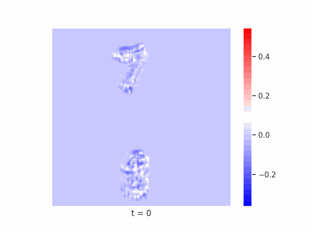</td>
    <td>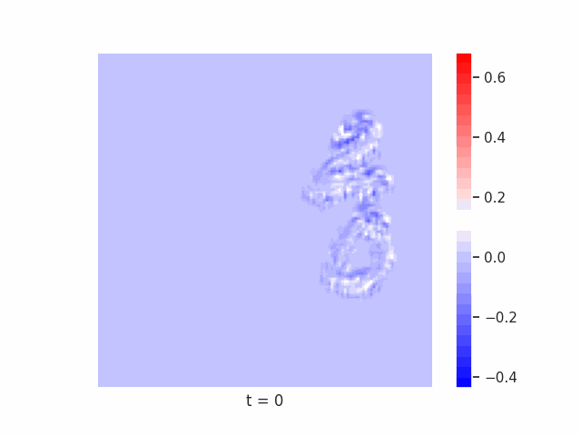</td>
    <td>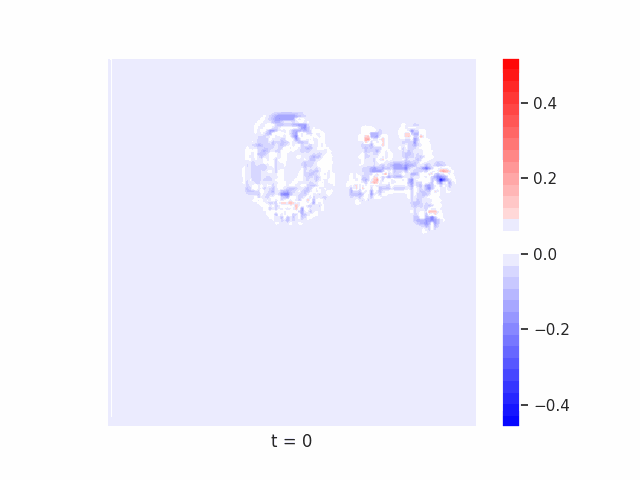</td>
  </tr>
  <tr>
    <td>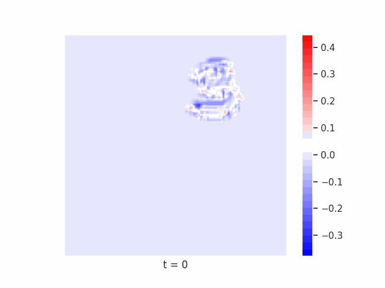</td>
    <td>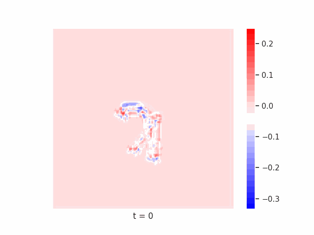</td>
    <td>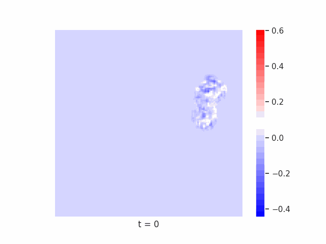</td>
  </tr>
  <tr>
    <td>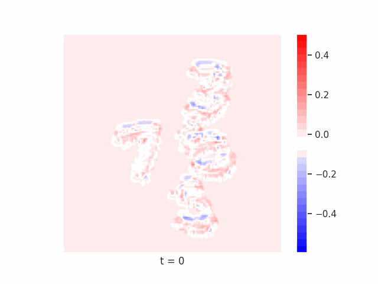</td>
    <td>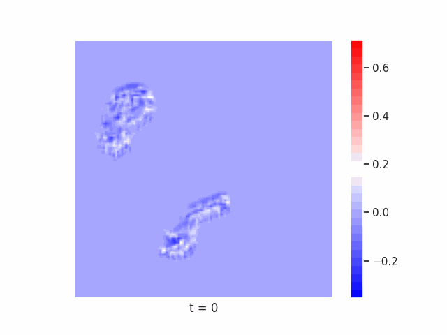</td>
    <td>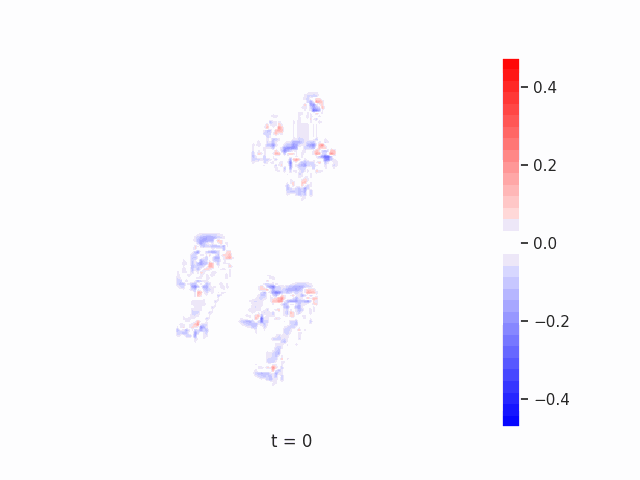</td>
  </tr>
</table>

## Tetrominoes NWM Waves
<table>
  <tr>
    <td>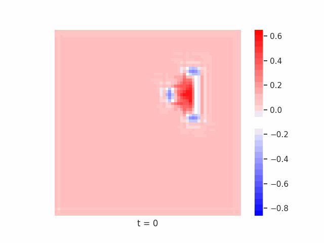</td>
    <td>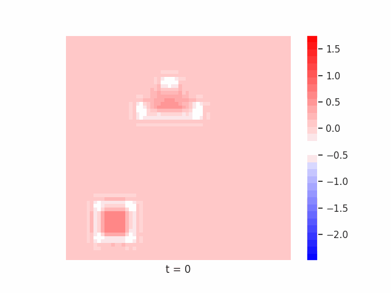</td>
    <td>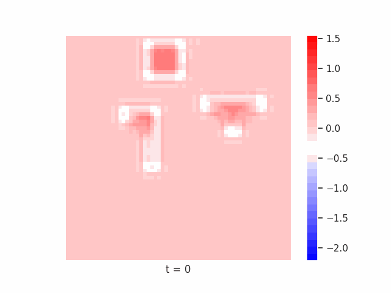</td>
  </tr>
  <tr>
    <td>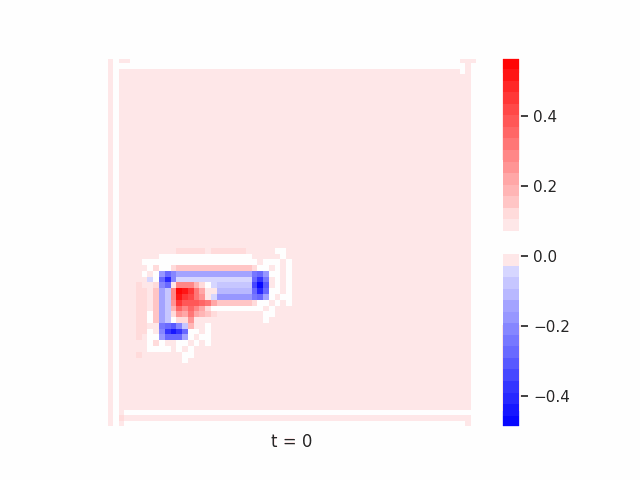</td>
    <td>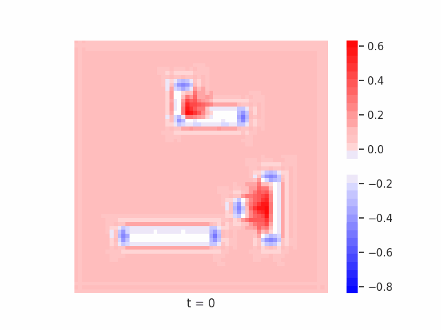</td>
    <td>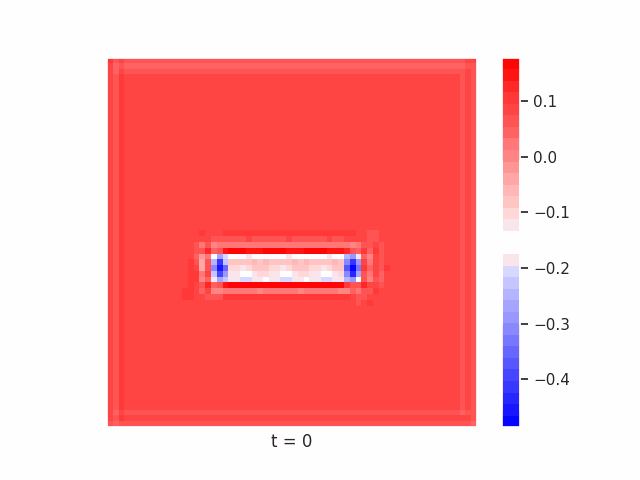</td>
  </tr>
  <tr>
    <td>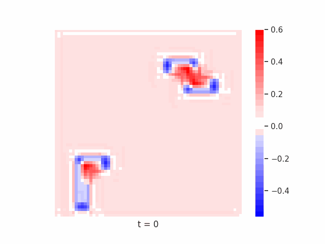</td>
    <td>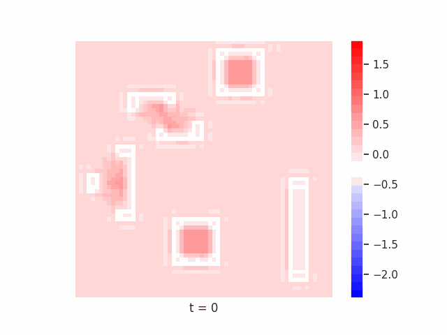</td>
    <td>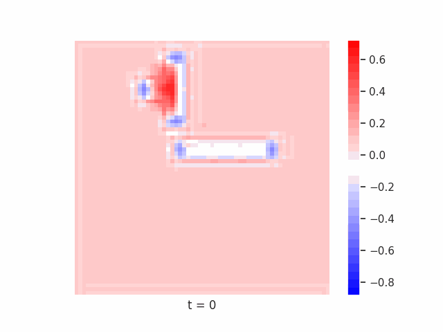</td>
  </tr>
</table>

## Tetrominoes LSTM Waves
<table>
  <tr>
    <td>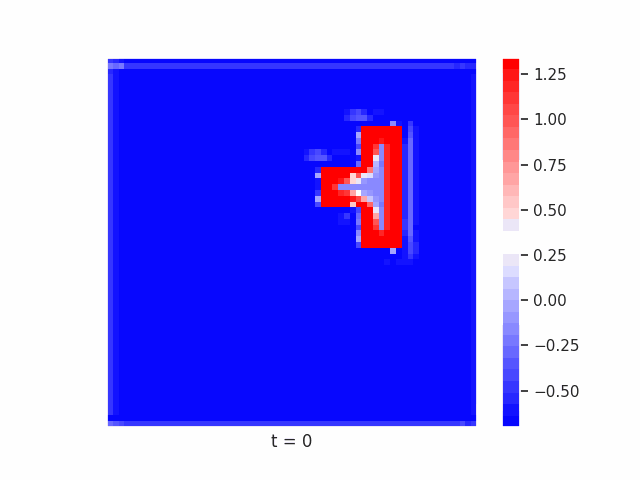</td>
    <td>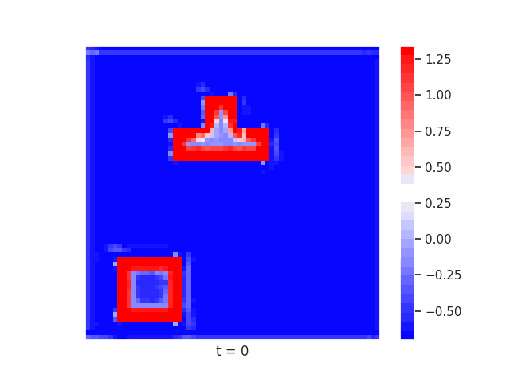</td>
    <td>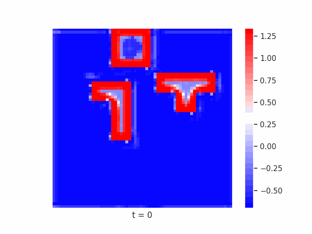</td>
  </tr>
  <tr>
    <td>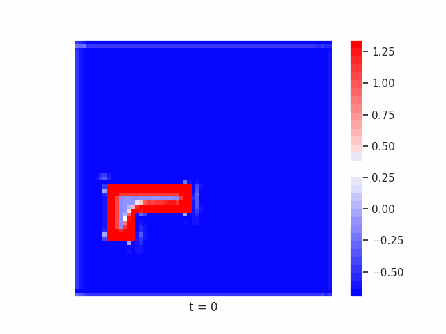</td>
    <td>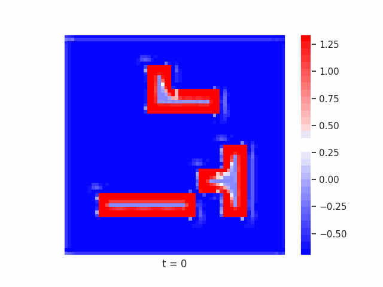</td>
    <td>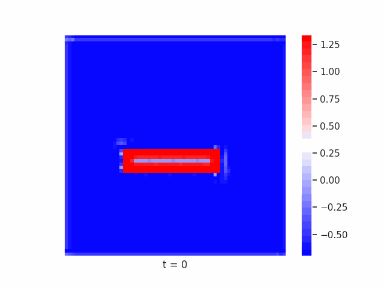</td>
  </tr>
  <tr>
    <td>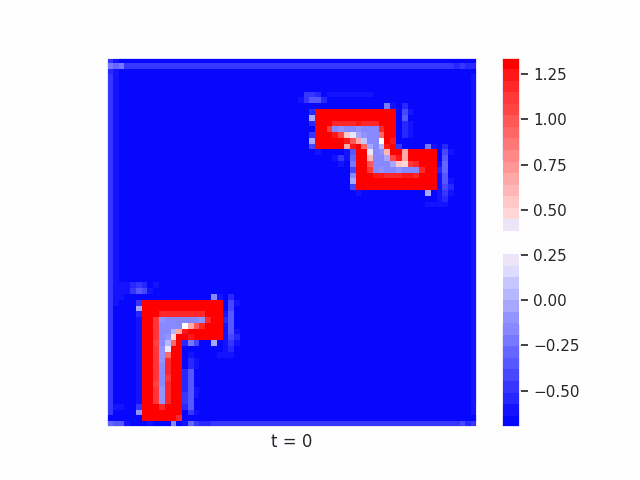</td>
    <td>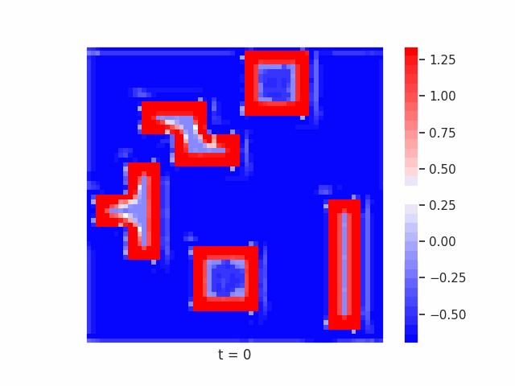</td>
    <td>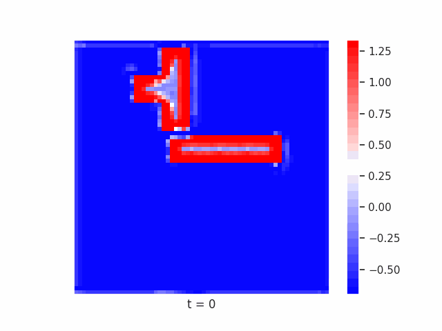</td>
  </tr>
</table>

## Reproducing results
1. Set up the conda environment using environment.yml.
2. Create data by running data_scripts/create_tetrominoes.py and data_scripts/download_mnist.py data_scripts/create_multi_mnist.py
3. Edit dataset_config.py with absolute paths to the generated data.
4. Train all the models by 'cd' into scripts-ccn-1, then 'cd' into each folder and run the desired training scripts.
5. Produce MNIST and Tetrominoes scores using produce_scores.py
6. Produce Multi-MNIST scores using produce_scores_multi-mnist.py
7. Process the MNIST and Tetrominoes scores using process_scores_df.ipynb and process_scores_df_min_max.ipynb
8. Process Multi-MNIST scores using process_scores_df_multi-mnist.ipynb
9. Produce the LSTM and NWM figure (Figure 5) using produce_fig_lstm_nwm.ipynb
10. Produce the square area theory results using Square_Area_Theory.ipynb
11. Produce the multi polygon results using Multi_Polygon_Classification.ipynb